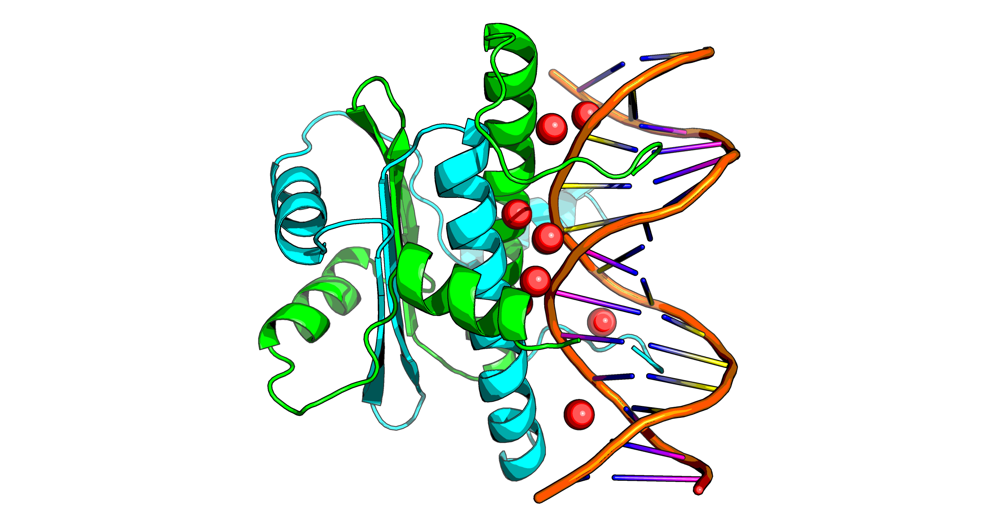

# MEF2C_analysis
Analysis of variants of MEF2C for [Dr Nicky Wiffin (Wellcome centre for Human Genetics, University of Oxford)](https://www.whiffinlab.org/).

The model used was a pre-made Swissmodel homodimer based upon PDB:6BYY. (89.47% identity).

## Clean-up	

PyMol code to add DNA and cleanup:

    load coords_2.pdb, swissmodel
    fetch 6byy
    select hydata, resn HOH and (byres (chain L+K and polymer) expand 3) and  (byres (chain A+B and polymer) expand 3)
    create combo, hydata or (chain L+K and polymer) or swissmodel
    
Do note, I therefore kept some trapped waters at the interface to make the analysis more accurate.

## Energy minimisation

The model was energy minimised against the [6BYY ED map](https://www.ebi.ac.uk/pdbe/entry/pdb/6byy) with a decreasing constraint
(5 cycles FastRelax at 30x, 5 at 20x, 5 at 10x). A final unconstrained minimisation 5-cycle was not done until after a change (below).

Due to the fact R15 appears to be DNA binding yet the DNA in the model is too short, the DNA was extended in PyMol:

    fnab AAAAAA, name=myDNA2, mode=DNA, form=B, dbl_helix=1
    align myDNA & chain A & resi 1, /MEF2C.r_1//K/DA`15/
    alter myDNA & chain A, resv+=14
    alter myDNA & chain A, chain='K'
    alter myDNA & chain B, resv+=3
    alter myDNA & chain B, chain='L'
    sort
    remove myDNA & chain L & resi 2
    remove myDNA & chain K & resi 15
    
    fnab TAAAAA, name=myDNA2, mode=DNA, form=B, dbl_helix=1
    align myDNA2 & chain A & resi 1, /MEF2C.r_1//L/DT`15/
    alter myDNA2 & chain A, resv+=14
    alter myDNA2 & chain A, chain='L'
    alter myDNA2 & chain B, resv+=3
    alter myDNA2 & chain B, chain='K'
    sort
    remove myDNA2 & chain K & resi 2
    remove myDNA2 & chain L & resi 15
    
    alter all, segi=''
    sort

The new parts ± 2 of the DNA were model were energy minimised with 15 FastRelax cycles.
Then the whole model was energy minimised for 5 cycles.

## Model additions

The model covers only 2-92. The protein beyond 136 is completely unstructured —the transactivation region. 
The potential helix 112-136 may go anywhere in the model as there is a large disordered linker before it.

To ascertain whether to add anything to the model other structures of MEF2A/B were checked.

* 1LEW shows a 12-mer in the 269 region bound to MAP kinase p38 —beyond the structured region
* 3P57 binds p300 TAZ2 domain in opposite side to the DNA, but no mutations studied fall there
* 1N6J likewise (CABIN1)

NB. MEF2 family binds to the mef2 motif. Thus, there is no MEF1 family.
